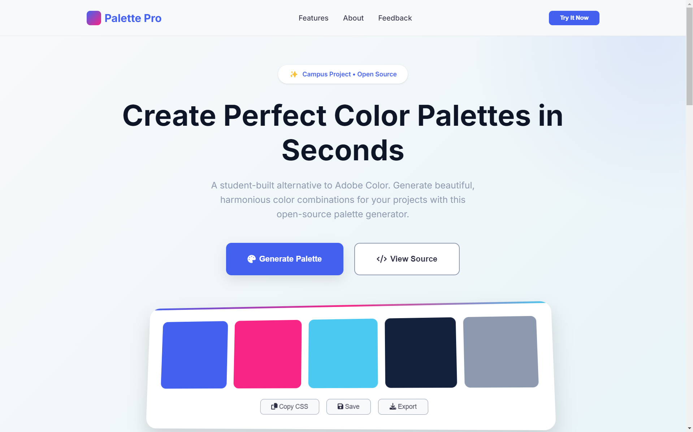

# Palette Pro - Professional Color Palette Generator



## Features
- Instant color palette generation
- CSS/SCSS/JSON export options
- Copy to clipboard functionality
- Fully responsive design
- Free and open source

## Project Structure
```
palette-pro/
├── assets/
│   ├── index.html
│   ├── script.js
│   └── style.css
├── index.html
├── script.js
└── style.css
```

## Getting Started
1. Clone the repository:
```bash
git clone https://github.com/codevwithali/palette-pro.git
```
2. Open `index.html` in your browser

## Usage
- Click "Generate Palette" to create new colors
- Use the action buttons to copy or save palettes
- Submit feedback via the rating form

## Technologies
- HTML5, CSS3, JavaScript
- Font Awesome icons
- Web3Forms integration
- Inter font family

## License
MIT License

---

Developed by [codevwithali](https://github.com/ipangbbd)
